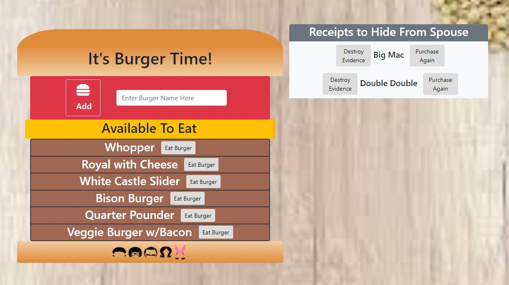

# Burger Time!
A fun web app that takes in the type of burger a user desires and transforms it into a patty. 

**Note:** Bun, patties, tomato, and cheese are made up of 
 elements

## Deployed Application:
https://dashboard.heroku.com/apps/burgertime1

## Instructions
*  Enter a name of a burger you'd like to add and click the "Add" button. This adds the burger to the "Available to Eat" section
* To eat the burger, click the "Eat Burger" button next to the burger you'd like to eat. The burger then moves to the "Receipts" section
* In the receipts section you can either "Destroy Evidence" which deletes the burger entry from the database, or "Purchase Again" which adds the burger back to the "Available to Eat" section

## Technologies Used:
* Node
* Express
* Handlebars
* ORM
* MySQL (local)
* Heroku / JawsDB (deployed)
* JS
* jQuery
* CSS
* HTML

## Screenshots

## Contributors
* Steve Thompson (sthmpsn)
